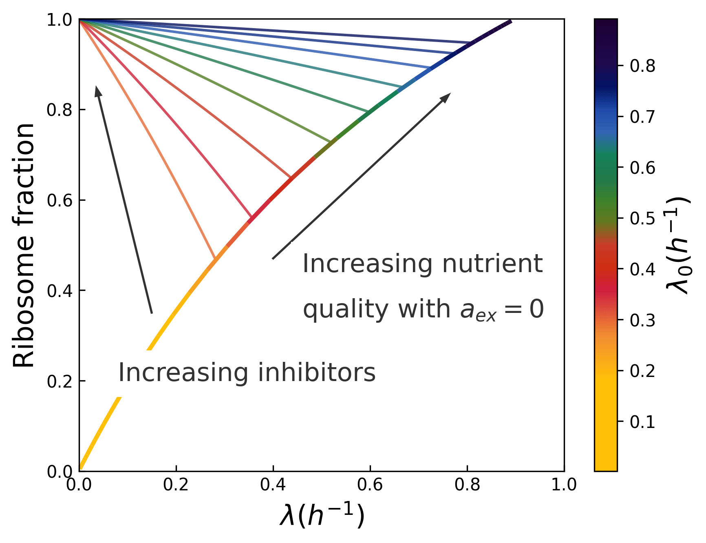

##### Abstract

Growth in bacterial populations generally depends on the environment 
(availability and quality of nutrients, presence of a toxic inhibitor, product inhibition..). 
Here, we build a model to describe the action of a bacteriostatic antibiotic, assuming that this 
drug inhibits an essential autocatalytic cycle involved in the cell metabolism. The model 
recovers known growth laws, can describe various types of antibiotics and confirms the existence 
of two distinct regimes of growth-dependent susceptibility, previously identified only for ribosome 
targeting antibiotics. Interestingly, below a certain threshold in terms of antibiotic concentration, 
a coexistence between two values of the growth rate is possible, which has also been observed experimentally. 
Interesting extensions of the model include the antagonistic effect of two drugs targeting different 
autocatalytic cycles or the production of an inhibiting waste.

<a href="https://doi.org/10.48550/arXiv.2501.02944"> ArXiv </a>, 
<a href="https://iopscience.iop.org/article/10.1088/1478-3975/ae1343"> Publisher </a>

---

##### Growth laws from theory



---

##### Citation

```BibTeX
@misc{ledoux2025inhibitionbacterialgrowthantibiotics,
      title={Inhibition of bacterial growth by antibiotics : A minimal model}, 
      author={Barnabe Ledoux and David Lacoste},
      year={2025},
      eprint={2501.02944},
      archivePrefix={arXiv},
      primaryClass={physics.bio-ph},
      url={https://arxiv.org/abs/2501.02944}, 
}