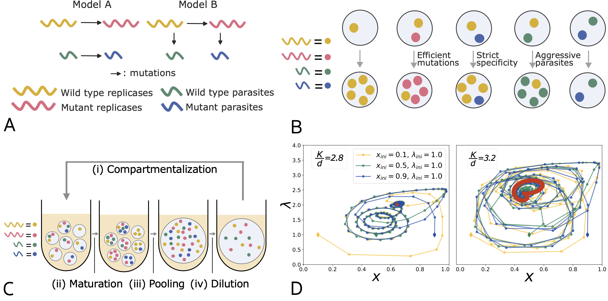

##### Abstract

The error catastrophe refers to the proliferation of non-functional molecules in conditions where molecular replication has low accuracy, which is likely to correspond to conditions present at the Origin of Life. This error catastrophe can be avoided thanks to transient compartmentalization, provided that the compartments are sufficiently tight to prevent molecular leakage. Typically, transient compartmentalization models assume that the content of the compartments is completely pooled periodically, resulting in the complete loss of the compositional memory of the compartment. Furthermore, previous models that include the possibility of ecological interactions between molecular parasites and replicators within compartments generally do not study the effect of transient compartmentalization on their coevolution. To address both issues, we develop a framework that accounts for the coevolution of molecular replicators and parasites, along with specific compartmentalization dynamics that are transient yet partial, allowing compositional memory to accumulate from one round of compartmentalization to the next. We benchmark our model with a serial dilution experiment that displays complex oscillatory dynamics among four well-characterized RNA replicators. We also perform experiments to quantify the level of mixing in compartments when stronger stirring tends to homogenize their composition. We then model stirring-induced mixing and show how stirring alters the dynamics of compartmentalized replicators. We conclude that compositional memory arising from transient compartmentalization plays a major role in the dynamics of early molecular systems.


<a href="https://doi.org/10.64898/2026.03.03.709225"> BiorXiv </a>,

---

##### Fig 1



---

##### Citation

```BibTeX
@article{
doi:10.1073/pnas.2537522123,
author = {Barnabe Ledoux  and Ryoka Kuwabara  and Norikazu Ichihashi  and Ryo Mizuuchi  and David Lacoste },
title = {Compositional memory matters for early molecular systems},
journal = {Proceedings of the National Academy of Sciences},
volume = {123},
number = {16},
pages = {e2537522123},
year = {2026},
doi = {10.1073/pnas.2537522123},
URL = {https://www.pnas.org/doi/abs/10.1073/pnas.2537522123},
eprint = {https://www.pnas.org/doi/pdf/10.1073/pnas.2537522123},
abstract = {Transient compartmentalization is thought to be essential for preventing parasites (short nonfunctional RNA sequences) from invading replicases (self-replicating RNA), but how compartmentalization behaviors specifically affect replicase-parasite dynamics remains unclear. Here, by combining experiments and modeling, we show that the extent of compositional memory—the degree to which molecular compositions are inherited within compartments across rounds of compartmentalization—alters replicase-parasite dynamics and therefore matters for early molecular systems. The error catastrophe refers to the proliferation of nonfunctional molecules in conditions where molecular replication has low accuracy, which is likely to correspond to conditions present at the Origin of Life. This error catastrophe can be avoided thanks to transient compartmentalization, provided that the compartments are sufficiently tight to prevent molecular leakage. Typically, transient compartmentalization models assume that the content of the compartments is completely pooled periodically, resulting in the complete loss of the compositional memory of the compartment. Furthermore, previous models that include the possibility of ecological interactions between molecular parasites and replicators within compartments generally do not study the effect of transient compartmentalization on their coevolution. To address both issues, we develop a framework that accounts for the coevolution of molecular replicators and parasites, along with specific compartmentalization dynamics that are transient yet partial, allowing compositional memory to accumulate from one round of compartmentalization to the next. We benchmark our model with a serial dilution experiment that displays complex oscillatory dynamics among four well-characterized RNA replicators. We also perform experiments to quantify the level of mixing in compartments when stronger stirring tends to homogenize their composition. We then model stirring-induced mixing and show how stirring alters the dynamics of compartmentalized replicators. We conclude that compositional memory arising from transient compartmentalization plays a major role in the dynamics of early molecular systems.}}
