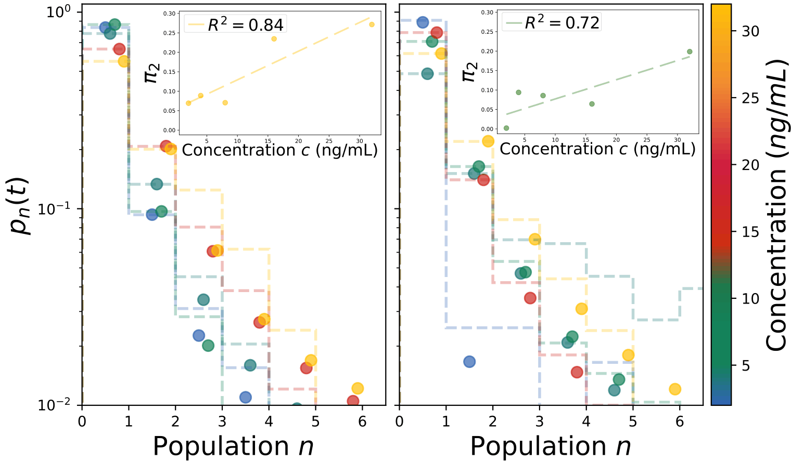

##### Abstract

With the development of microfluidics, it has now become possible to assess the susceptibility of bacteria to antibiotics at the single-cell level instead of relying on population measurements. Such studies are particularly relevant when the growth of bacterial population in the presence of antibiotics is heterogeneous. Here, we build a model to describe such a case, and apply it to experimental measurements on a small population of E. Coli exposed to ciprofloxacin, a drug which is well known for triggering a bistable response.
---

##### Comparison to experiments



---

##### Citation

```BibTeX
