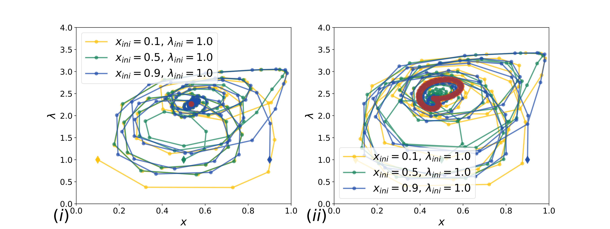

---

##### Download

+ [Presentation](Compositional_memory_LEDOUX_physics_&_life.pdf)

---

##### Abstract

Transient compartmentalization is essential to avoid parasites (short non-functional RNA sequences) to invade a molecular replicating system, but how  compartmentalization dynamics specifically affect the host-parasite dynamics is unclear. To address this issue, we perform a combination of experiments with modeling, to show that compositional memory is present in this experiment and matters for early molecular systems.

---

##### Oscillations and coexistence

---